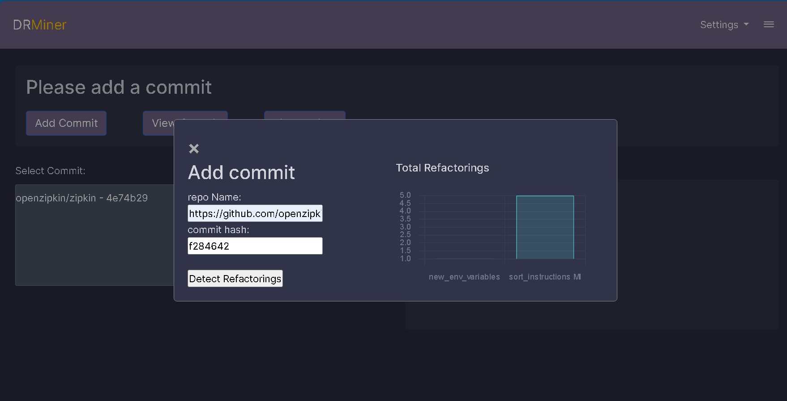
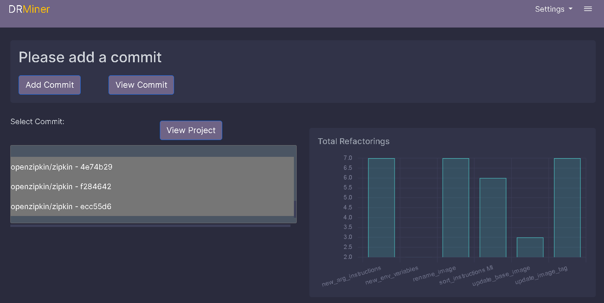
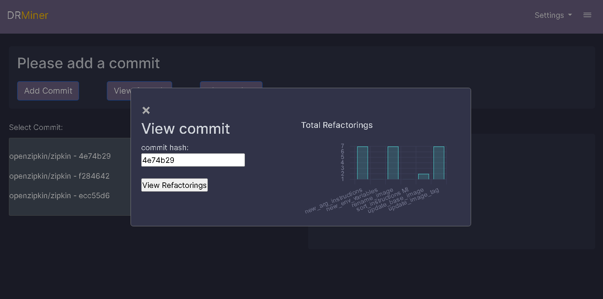

# General info
DRMiner is a tool written in python that can detect Dockerfile refactorings applied in the history of a Docker project.

Currently, it supports the detection of the following refactorings:


**<ins>supported by DRMiner 1.0 </ins>**

1. Add ENV Variable
2. Add ARG Instruction 
3. Replace ADD with COPY
4. Update Base Image
5. Update Base Image tag
6. Rename Image
7. Inline Run Instructions
8. Extract RUN Instructions
9. Sort Instructions
10. Extract Stage
11. Inline Stage
12. Move Stage

# Contributors
* [Anonymos]


# Current precision and recall
As of **11 November, 2023** the precision and recall of the tool on an oracle consisting of **351 Dockerfiles**  from **223 commits**  across **187 unique projects**  is:

| Refactoring Type            | TP  | FP | FN | Precision     | Recall        | F1    |
|-----------------------------|-----|----|----|---------------|---------------|-------|
| Move Stage                  | 1   | 0  | 0  | 100.00%       | 100.00%       | 1.00  |
| Inline Stage                | 2   | 0  | 0  | 100.00%       | 100.00%       | 1.00  |
| Update Base Image           | 63  | 58 | 0  | 52.00%        | 100.00%       | 0.68  |
| Inline Run Instruction       | 121 | 0  | 25 | 100.00%       | 83.00%        | 0.91  |
| Extract Run Instruction      | 12  | 0  | 0  | 100.00%       | 100.00%       | 1.00  |
| Add ARG Instruction          | 105 | 3  | 0  | 97.00%        | 100.00%       | 0.99  |
| Add ENV Variable             | 195 | 3  | 0  | 96.00%        | 100.00%       | 1.00  |
| Sort Instructions            | 104 | 7  | 0  | 94.00%        | 100.00%       | 0.97  |
| Rename Image                | 21  | 0  | 0  | 100.00%       | 100.00%       | 1.00  |
| Extract Stage               | 15  | 0  | 0  | 100.00%       | 100.00%       | 1.00  |
| Update Base Image Tag       | 94  | 1  | 0  | 99.00%        | 100.00%       | 0.99  |
| Replace ADD with COPY       | 29  | 0  | 0  | 100.00%       | 100.00%       | 1.00  |
| Overall                     | 780 | 69 | 25 | 91.90%        | 96.90%        | 0.94|


# How to Use DRMiner from the command line

## Installation
Before using DRMiner, ensure you have **Python 3.10.2** or newer installed on your system. DRMiner can be cloned or downloaded from its repository.

Before using the tool, make sure you have all the required dependencies installed. The dependencies are listed in the `requirements.txt` file. To install these dependencies, run the following command in your terminal:

```bash
pip install -r requirements.txt
```

## Usage
DRMiner can be executed in three different modes depending on the scope of the analysis:

1. Analyze a specific Dockerfile in a specific commit:
   ```bash
   python drminer.py <repo> --commit <commithash> --path <DockerfilePath>
   ```

2. Analyze all Dockerfiles in a specific commit:
   ```bash
   python drminer.py <repo> --commit <commithash>
   ```

3. Analyze all commits in a project:
   ```bash
   python drminer.py <repo>
   ```

Replace `<repo>`, `<commithash>`, and `<DockerfilePath>` with the appropriate repository URL, commit hash, and Dockerfile path, respectively.

## Output
DRMiner generates two types of output files:

1. **Results_projectName.json**: This file details the refactorings in each analyzed commit of the project. It includes information about which Dockerfile was analyzed and the specifics of each refactoring detected within it.

2. **Refactorings_Stats_imaginary.json**: This file provides statistical data on the refactorings. It includes the count of refactorings per analyzed commit and the total count of refactorings within the project.


## Example:

For example if you run `python drminer.py h2non/imaginary --commit 4a4214a --path  /Dockerfile` you will get the following output file:

 1. `Results-imaginary.json`
```json
[
    {
        "commit_hash": "4a4214a",
        "dockerfile_changes": [
            {
                "dockerfile_path": "/Dockerfile",
                "refactorings": {
                    "new_env_variables": [
                        "GO111MODULE"
                    ],
                    "new_arg_instructions": [
                        "GOLANG_VERSION",
                        "GOLANGCILINT_VERSION"
                    ],
                    "replace_add_with_copy": [],
                    "update_image_tag": [
                        {
                            "image_name": "golang",
                            "old_tag": "1.11.5",
                            "new_tag": "1.12.9"
                        },
                        {
                            "image_name": "debian",
                            "old_tag": "stretch-slim",
                            "new_tag": "buster-slim"
                        }
                    ],
                    "update_base_image": [],
                    "rename_image": [],
                    "inline_run_instructions": [],
                    "extract_run_instructions": [],
                    "sort_instructions": [],
                    "extract_stage": [],
                    "inline_stage_refactoring": [],
                    "move_stage": []
                }
            }
        ]
    }
]
```
Morover, if you run `python drminer.py h2non/imaginary` you will get the following output files:

1. `Results-imaginary.json`
```json
[
    {
        "commit_hash": "9489834",
        "dockerfile_changes": [
            {
                "dockerfile_path": "/Dockerfile",
                "refactorings": {
                    "new_env_variables": [],
                    "new_arg_instructions": [],
                    "replace_add_with_copy": [],
                    "update_image_tag": [
                        {
                            "image_name": "golang",
                            "old_tag": "1.17-buster",
                            "new_tag": "1.17-bullseye"
                        },
                        {
                            "image_name": "debian",
                            "old_tag": "buster-slim",
                            "new_tag": "bullseye-slim"
                        }
                    ],
                    "update_base_image": [],
                    "rename_image": [],
                    "inline_run_instructions": [],
                    "extract_run_instructions": [],
                    "sort_instructions": [],
                    "extract_stage": [],
                    "inline_stage_refactoring": [],
                    "move_stage": []
                }
            }
        ]
    },
    {
        "commit_hash": "73bdca8",
        "dockerfile_changes": [
            {
                "dockerfile_path": "/Dockerfile",
                "refactorings": {
                    "new_env_variables": ["LD_PRELOAD"],
                    "new_arg_instructions": [],
                    "replace_add_with_copy": [],
                    "update_image_tag": [],
                    "update_base_image": [],
                    "rename_image": [],
                    "inline_run_instructions": [],
                    "extract_run_instructions": [],
                    "sort_instructions": [],
                    "extract_stage": [],
                    "inline_stage_refactoring": [],
                    "move_stage": []
                }
            }
        ]
    }
    // ... additional entries (the file size was too long) ...
]

 
```
2. `Refactorings_Stats_imaginary.json`
```json
{
    "commit_refactorings": {
        "9489834": {
            "update_image_tag": 2
        },
        "73bdca8": {
            "new_env_variables": 1
        },
        "a244cd9": {
            "update_image_tag": 1
        },
        "3fc9db7": {
            "update_image_tag": 1
        },
        "c2825a6": {
            "update_image_tag": 1
        },
        "384bb00": {
            "update_image_tag": 1
        },
        "502db5e": {
            "update_image_tag": 1
        },
        "4a4214a": {
            "new_env_variables": 1,
            "new_arg_instructions": 2,
            "update_image_tag": 2
        },
        "3557ff1": {
            "new_arg_instructions": 5,
            "update_base_image": 2
        },
        "b760d27": {
            "new_arg_instructions": 1
        },
        "a4a2593": {
            "inline_run_instructions": 1
        },
        "607d843": {
            "rename_image": 1
        },
        "8357de9": {
            "new_arg_instructions": 1,
            "update_base_image": 1,
            "rename_image": 1
        },
        "c703900": {
            "update_base_image": 1
        },
        "c81284b": {
            "update_image_tag": 1
        },
        "322292a": {
            "new_arg_instructions": 2,
            "update_base_image": 2
        },
        "0a01b16": {
            "new_arg_instructions": 2,
            "update_base_image": 1
        },
        "fd70630": {
            "update_base_image": 1
        },
        "2b2d5f7": {
            "new_arg_instructions": 5,
            "update_base_image": 1
        },
        "00680eb": {
            "new_env_variables": 1,
            "extract_stage": 1
        },
        "07a2509": {
            "update_image_tag": 1
        },
        "3a6b25a": {
            "new_env_variables": 4,
            "update_base_image": 1
        },
        "7da4696": {
            "update_image_tag": 1
        },
        "42030b4": {
            "new_env_variables": 1
        },
        "0093c3b": {
            "new_env_variables": 1
        },
        "c89b000": {
            "new_env_variables": 1
        },
        "31af1fc": {
            "update_image_tag": 1
        },
        "a1c26bf": {
            "update_image_tag": 1
        },
        "5f77300": {
            "new_env_variables": 2,
            "inline_run_instructions": 1,
            "sort_instructions": 1
        },
        "658632a": {
            "inline_run_instructions": 1
        },
        "4821fb1": {
            "sort_instructions": 1
        },
        "47f7e66": {
            "new_env_variables": 4,
            "update_base_image": 1
        }
    },
    "total_refactorings": {
        "update_image_tag": 14,
        "new_env_variables": 16,
        "new_arg_instructions": 18,
        "update_base_image": 11,
        "inline_run_instructions": 3,
        "rename_image": 2,
        "extract_stage": 1,
        "sort_instructions": 2
    }
}

```
# How to Use DRMiner as Dashbord (Optional- beta version)



Before you can use the Dashboard Name, you need to initialize the database. Follow these steps: 

```bash 
flask db init 
flask db migrate -m "Initial" 
flask db upgrade 
```

To run the Dashboard, follow these steps: Run the application: 
```bash 
python app.py 
```

Access the dashboard with

[http://localhost:5000](http://localhost:5000/)


The Dashbord version of the project is currently under development and may not be fully functional. Stay tuned for updates!
